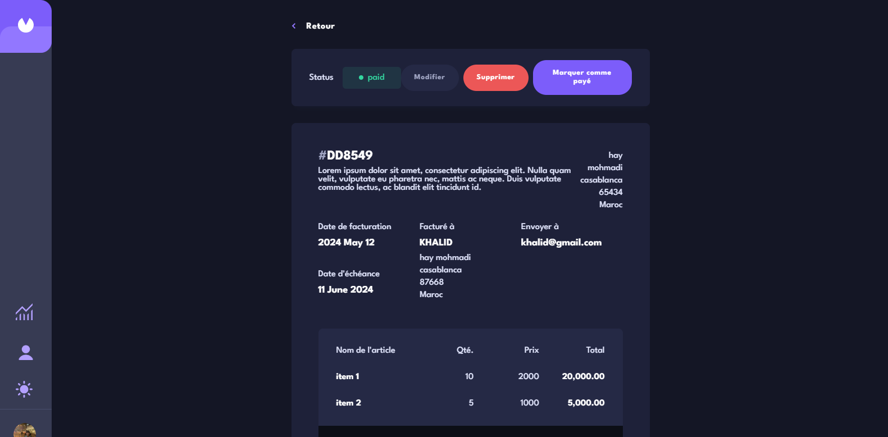

# Frontend Mentor - Invoice App Solution

Cette solution est réalisée pour le [défi de l'application de factures sur Frontend Mentor](https://www.frontendmentor.io/challenges/invoice-app-i7KaLTQjl). Avec une addition personnelle : une page de graphiques pour visualiser les statistiques de vos factures. Les défis de Frontend Mentor vous aident à améliorer vos compétences en codage en créant des projets réalistes.

## 🔗 Liens

- URL de la solution : [Cliquez ici](https://github.com/HatimIlyas04/APP-FACTURE)
- URL du site en ligne : [Cliquez ici](https://invoice-app-six-delta.vercel.app/)

### 🎯 Le défi

Les utilisateurs doivent être capables de :

- Voir la mise en page idéale pour l'application, en fonction de la taille de l'écran de l'appareil
- Voir les états de survol pour tous les éléments interactifs de la page
- Créer, lire, mettre à jour et supprimer des factures
- Recevoir des validations de formulaire lors de la création/modification d'une facture
- Enregistrer des factures en tant que brouillons et marquer les factures en attente comme payées
- Filtrer les factures par statut (brouillon/en attente/payé)
- Changer le mode clair et sombre

### 🛠️ Construit avec

- [React](https://reactjs.org/) - Bibliothèque JS
- [Redux](https://redux.js.org/) - Redux
- [Styled Components](https://styled-components.com/) - Pour les styles

### 🚀 Ce que j'ai appris

L'un des plus grands défis auxquels j'ai été confronté était la décision de ne pas utiliser de bibliothèques externes pour aider à la création des composants, comme celui de la date par exemple, ni à la création des graphiques. Cependant, cela m'a permis de mettre en pratique toutes les connaissances que j'ai acquises lors du développement de l'application. J'ai également pu constater en pratique les avantages de sauvegarder les données dans un état global en utilisant Redux.

En ce qui concerne les graphiques, le plus grand défi était la création du graphique en secteurs, où j'ai utilisé la propriété `conic-gradient` pour séparer les couleurs. J'ai utilisé le pourcentage de chaque statut et l'ai transformé en degrés de 0 à 360. Ensuite, j'ai créé une fonction pour identifier dans quelle partie du graphique l'utilisateur passe la souris, en fonction des degrés, afin d'afficher une infobulle correspondante.

### 👨‍💻 Auteur

- **Ilyas Hatim** - Stage
- LinkedIn - [Ilyas Hatim](https://www.linkedin.com/in/ilyas-hatim/)
- Frontend Mentor - [@HatimIlyas04](https://www.frontendmentor.io/profile/HatimIlyas04)
