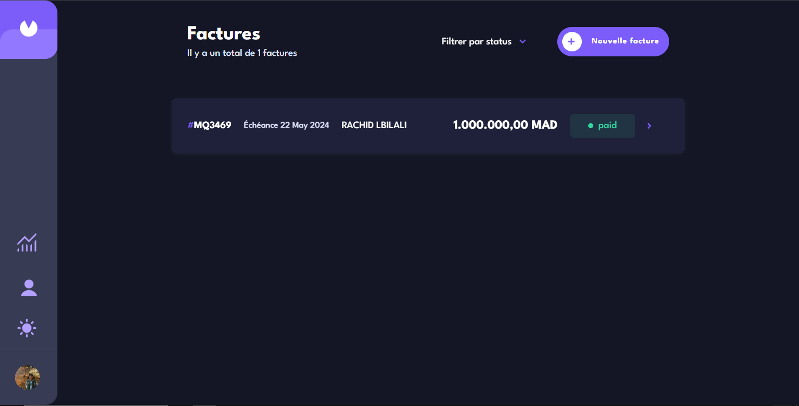
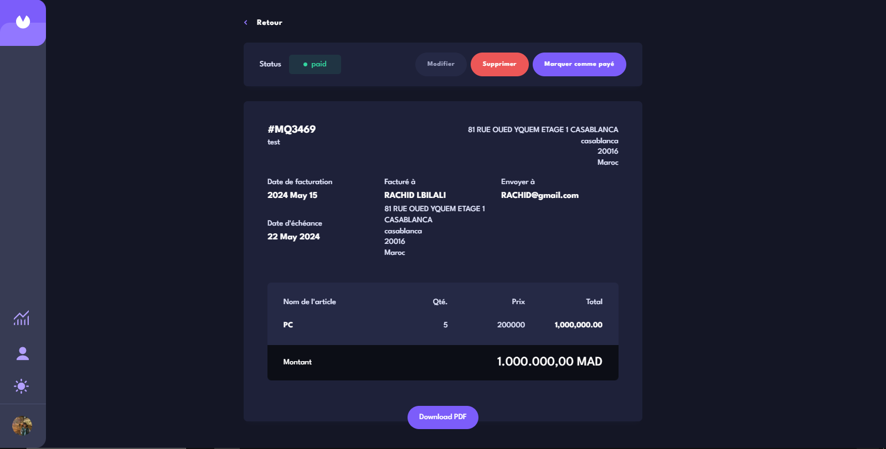
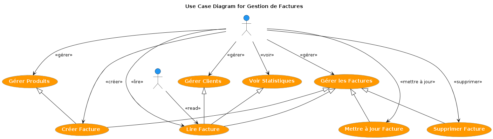
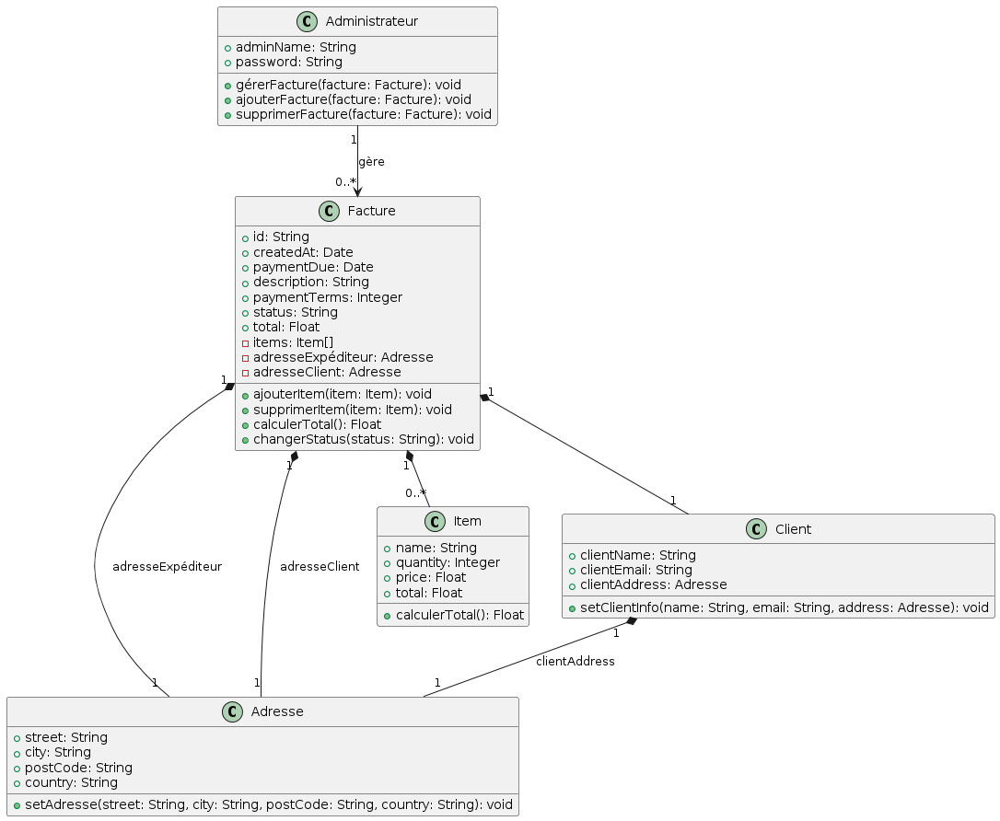
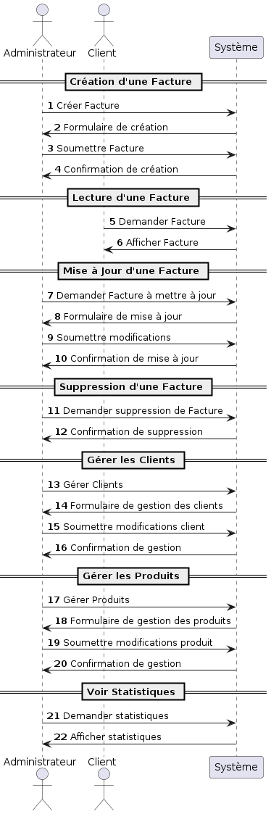

# Facture-App - Application de Gestion de Factures 💼💸

Facture-App est une solution complète de gestion de factures qui permet aux entreprises de créer, lire, mettre à jour, supprimer et gérer efficacement leurs factures, clients, et produits. Cette application propose également des statistiques visuelles pour une meilleure prise de décision.

## Table des Matières 📚

1. [Description](#description)
2. [Diagrammes](#diagrammes)
   - [Diagramme de Cas d'Utilisation](#diagramme-de-cas-dutilisation)
   - [Diagramme de Classes](#diagramme-de-classes)
   - [Diagramme de Séquence](#diagramme-de-séquence)
3. [Technologies Utilisées](#technologies-utilisées)
4. [Installation](#installation)
5. [Auteur](#auteur)
6. [Licence](#licence)

## Description 📝

Facture-App est conçu pour aider les administrateurs à gérer les factures de manière efficace et intuitive. Les administrateurs peuvent créer, lire, mettre à jour et supprimer des factures. Les clients peuvent consulter et télécharger leurs factures. L'application permet également de gérer les clients et les produits et de visualiser les statistiques pour une meilleure analyse des données.

## Diagrammes 📊

### Diagramme de Cas d'Utilisation 🔍

Ce diagramme montre les principales interactions entre les administrateurs, les clients et le système pour la gestion des factures. Les administrateurs peuvent gérer les factures, les clients, les produits et voir les statistiques, tandis que les clients peuvent lire et télécharger leurs factures.

### Diagramme de Classes 🏷️

Ce diagramme illustre les classes principales du système, y compris `Facture`, `Adresse`, `Item`, `Client`, et `Administrateur`, ainsi que leurs attributs et leurs relations.

### Diagramme de Séquence 🔄

Ce diagramme décrit les interactions entre les administrateurs, les clients et le système pour les opérations clés comme la création, la lecture, la mise à jour, la suppression et le téléchargement des factures.

## Technologies Utilisées 🛠️

- [React](https://reactjs.org/) - Bibliothèque JavaScript
- [Redux](https://redux.js.org/) - Gestion de l'état
- [Styled Components](https://styled-components.com/) - Pour les styles

## Installation ⚙️

1. Clonez le repository : `git clone https://github.com/hatimilyas04/Facture-App.git`
2. Accédez au répertoire du projet : `cd Facture-App`
3. Installez les dépendances : `npm install`
4. Démarrez l'application : `npm start`

## Auteur ✍️

- GitHub - [HATIM ILYAS](https://github.com/hatimilyas04)
- LinkedIn - [hatim Ilyas](https://www.linkedin.com/in/hatimilyas04/)

## Licence 📄

Ce projet est sous licence MIT.
